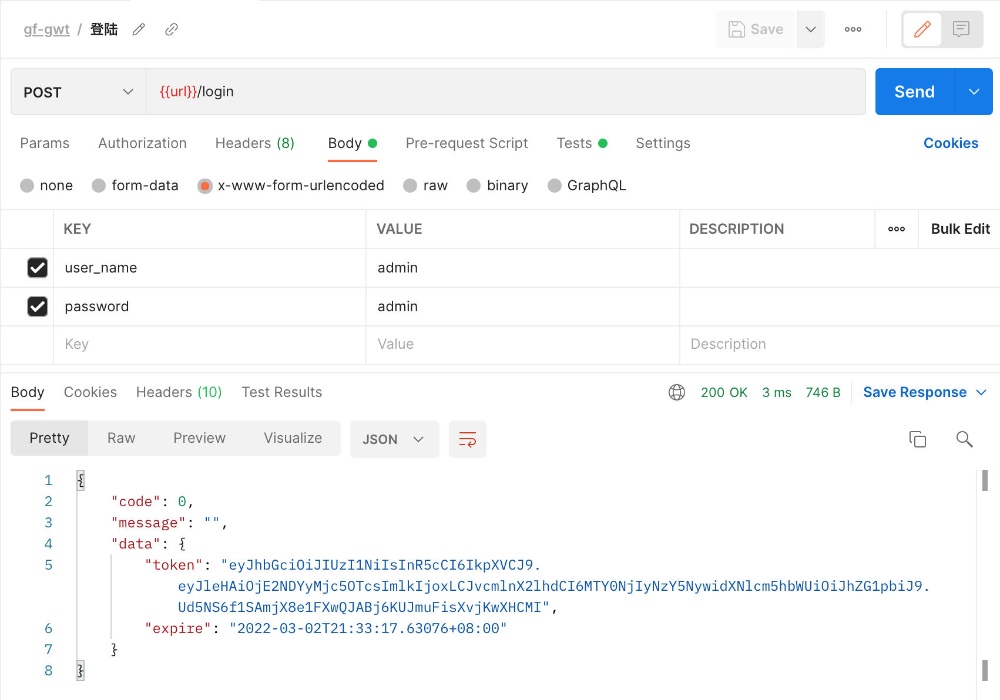
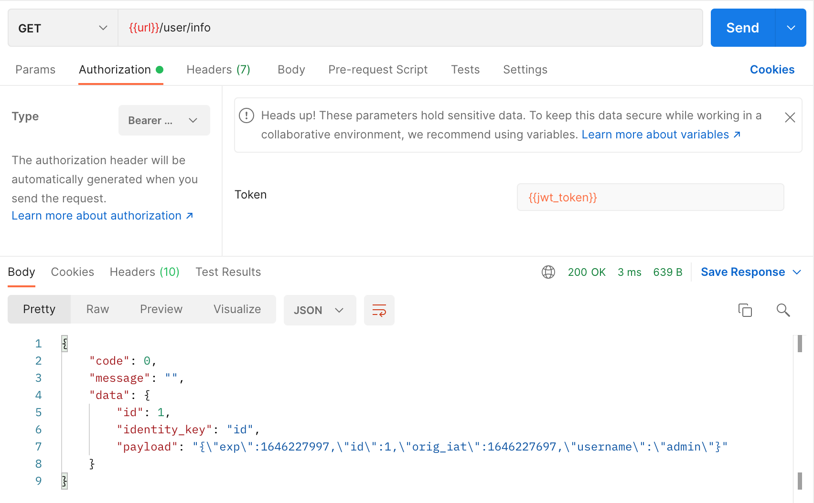
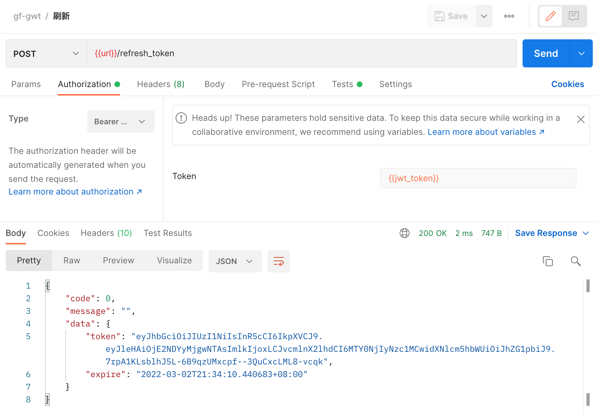

# gf-jwt v3

This is a jwt middleware for GoFrame.

It uses jwt-go to provide a jwt authentication middleware. It provides additional handler functions to provide the login api that will generate the token and an additional refresh handler that can be used to refresh tokens.

## Use

Download and install

```sh
$ go get github.com/UncleChair/gf-jwt/v3
```

Import

```go
import "github.com/UncleChair/gf-jwt/v3"
```









